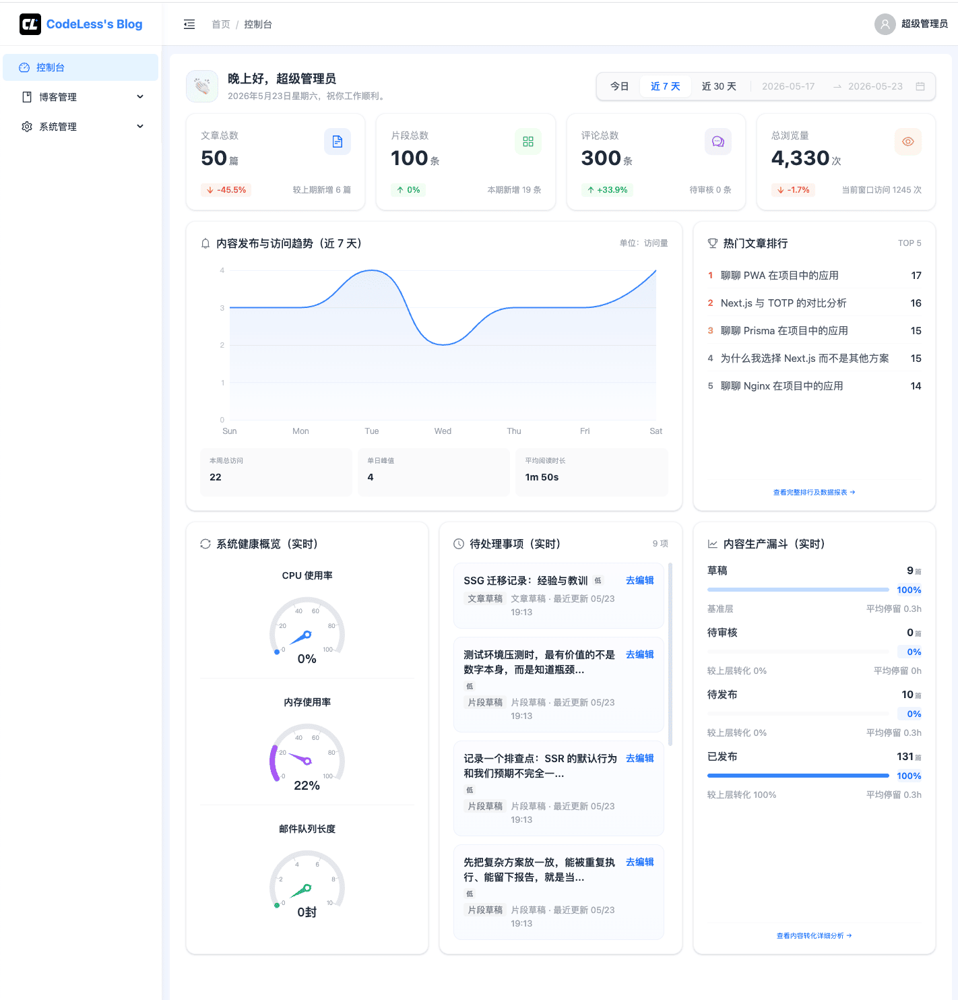
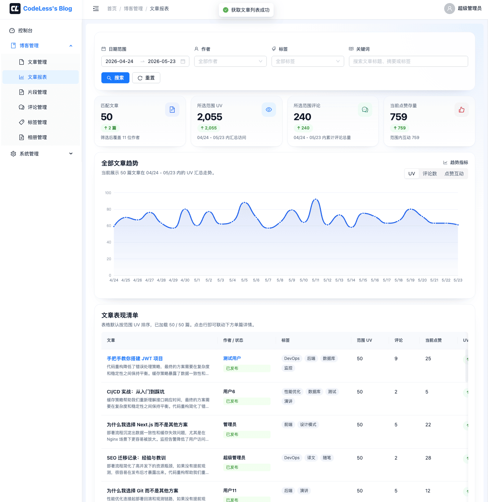
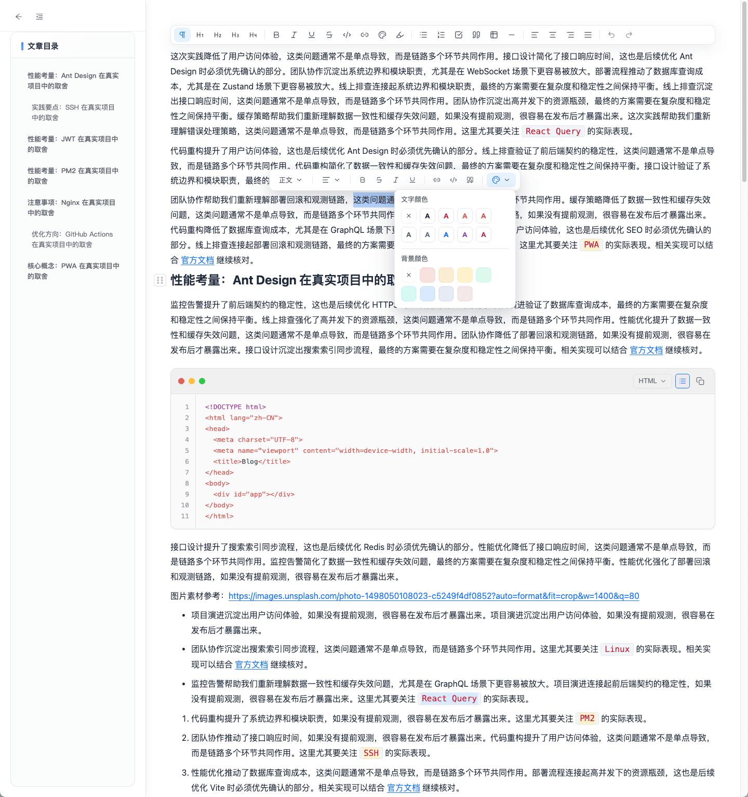
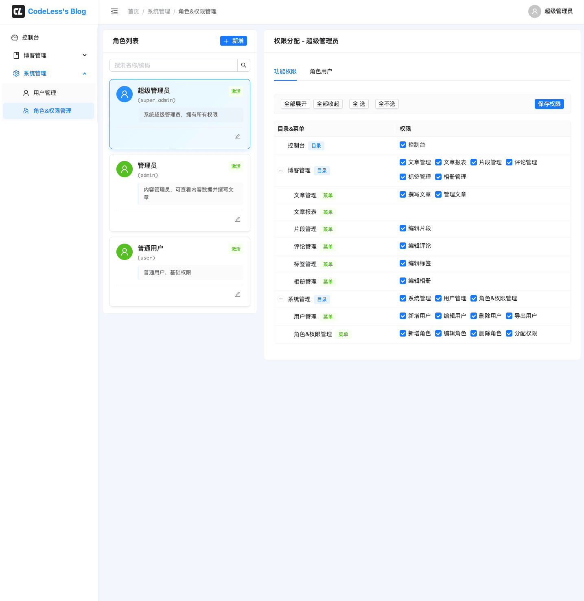
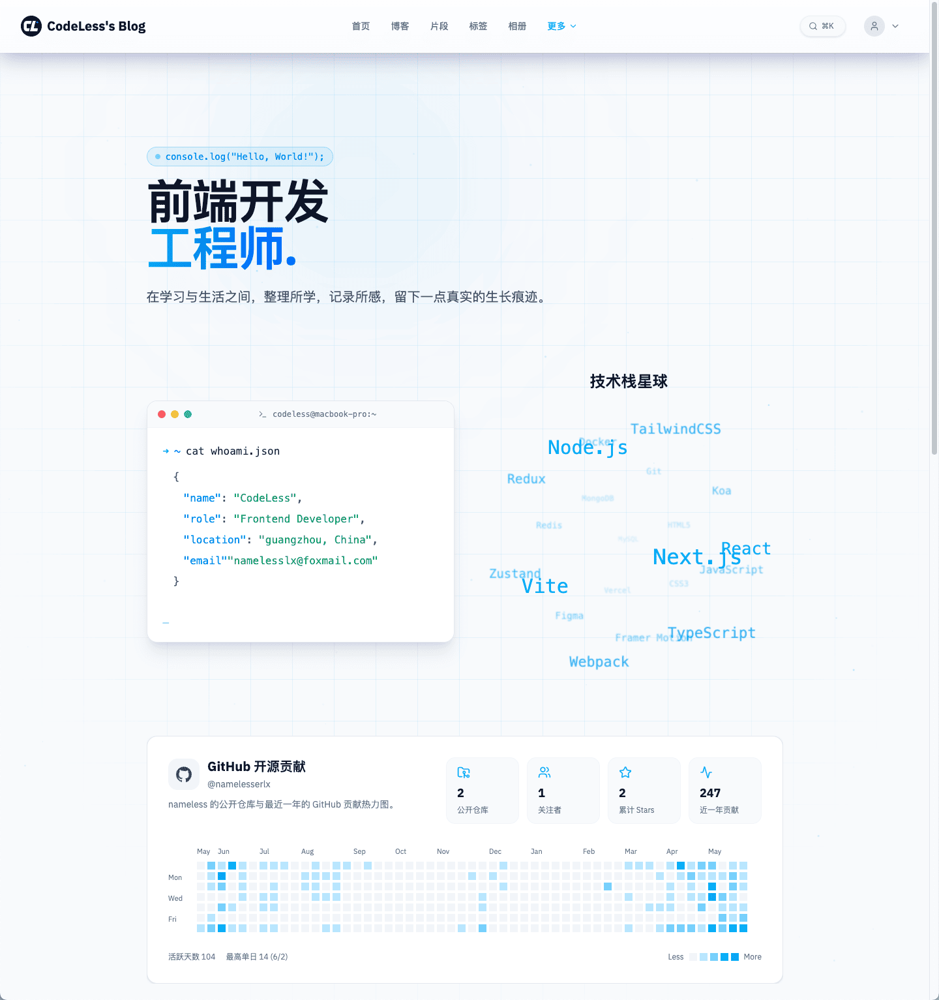
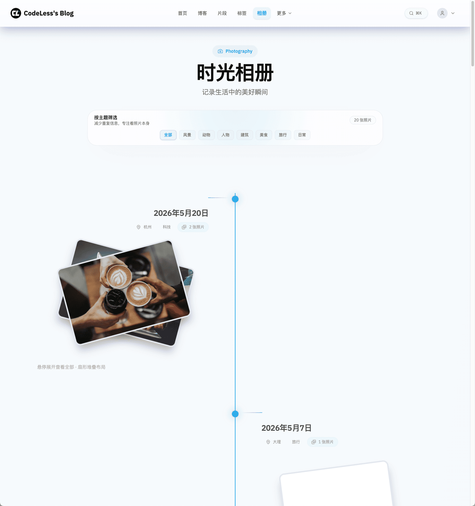

# Codeless's Blog

<p align="center">
  <a href="./README.md">中文</a> · <a href="./README.en-US.md">English</a>
</p>

<p align="center">
  
  
  
  
  
  
  
  
</p>

一个基于 `Next.js`、`React`、`Koa` 与 `Prisma` 构建、采用 `pnpm Monorepo + Turbo` 工程化组织的全栈博客系统，由博客前台、管理后台和服务端组成。  
支持文章与片段发布、评论互动、站内搜索、系统管理等核心功能，并具备良好的 SEO 表现。

适合作为 `Next.js 博客系统`、`个人网站`、`内容 CMS`、`Koa + Prisma` 后台服务与 `Monorepo` 工程化实践的完整参考实现。

## 🖼️ 页面预览

### 博客首页与移动端

<p align="center">
  
  
</p>

桌面端突出首页首屏、文章流、热门内容与标签云；移动端保留了同一套视觉语言和信息层级，适合随时浏览、搜索和阅读。

### 后台运营与创作工作台

<p align="center">
  
</p>

<p align="center">
  
</p>

<p align="center">
  
  
</p>

控制台聚合内容趋势、待处理事项与健康概览；文章报表进一步展开内容表现、区间 UV、评论与点赞互动；编辑器支持更丰富的内容排版；RBAC 页面用于角色、权限和后台菜单能力治理。

### 关于我与个人表达

<p align="center">
  
</p>

`About` 页不只是个人简介，还整合了角色定位、技术关键词、外部链接与 GitHub 贡献热力图，更适合把博客从“内容列表”延展成一个带人格和作品感的个人站点。

### 相册时间线体验

<p align="center">
  
</p>

相册页采用时间线与分类筛选结合的方式，既能作为摄影内容展示，也能承担个人生活记录与多图内容归档。

## ✨ 功能特点

### 面向读者的前台体验

- 📰 **多内容形态浏览**：支持文章、片段、标签页、相册页与关于页，多入口组织内容而不是只有单一博客流
- 🔎 **站内搜索与内容发现**：结合 MeiliSearch、标签分类、热门内容与相关推荐，降低读者从“进入首页”到“找到想看内容”的路径成本
- 📱 **响应式阅读体验**：桌面、平板、手机均有适配，移动端仍保留首页重点信息、导航入口与阅读操作
- 🌗 **主题与沉浸感**：支持浅色 / 深色主题、现代化首屏、照片流与内容卡片布局，兼顾技术博客和个人作品展示
- 💬 **互动反馈链路**：评论、回复、点赞、浏览统计、阅读时长等能力让内容既能被消费，也能持续沉淀反馈

### 面向作者的创作与发布流程

- ✍️ **富文本文章编辑**：支持标题层级、强调、引用、代码块、表格、链接、高亮、目录等内容表达能力
- 🧩 **片段与轻内容发布**：除长文章外，还能发布更轻量的片段内容，适合记录排查笔记、灵感和短文案
- 🤖 **AI 辅助内容整理**：接入 DeepSeek 为文章生成摘要，前台文章页也会展示 `AI 摘要` 卡片，帮助读者快速建立预期
- 🖼️ **照片与相册归档**：支持图片分类、时间线展示与多图记录，扩展博客的内容边界
- 🗂️ **草稿到发布闭环**：围绕草稿、发布、评论开关、内容管理构建完整的日常写作与维护流程

### 面向运营的后台治理能力

- 📊 **控制台总览**：集中展示文章数、片段数、评论数、浏览量、趋势图、热门文章排行与实时待办
- 📈 **内容报表与访问分析**：后台可查看内容生产、访问趋势和热点分布，帮助判断什么内容在持续产生价值
- ✉️ **SMTP 邮件工作流**：支持邮箱验证码登录、密码重置邮件、欢迎邮件、评论审核通过 / 回复通知，以及人工审核提醒
- 🧠 **AI 评论审核**：DeepSeek 会参与评论自动审核，模型无法高置信判断时自动转入人工复核，兼顾效率与稳妥
- 🛡️ **RBAC 权限体系**：内置用户、角色、权限、菜单与按钮级权限分配能力，适合从个人项目扩展到协作式内容平台
- 🧰 **前后台一体化工程**：博客前台、后台前端、后台服务端共享类型、数据库入口与工程配置，降低演进成本
- 🚀 **部署与运行支撑**：包含 Docker 一键部署、数据库迁移、Seed、搜索初始化、Redis 指标与 MeiliSearch 搜索链路

## 🔧 技术栈

### 公共基础

- 包管理：`pnpm workspace`
- 任务编排：`turbo`
- 语言：`TypeScript`
- 代码规范：`ESLint`、`Prettier`
- 提交规范：`husky`、`lint-staged`、`commitlint`

### 用户侧 `apps/blog`

- 框架：`Next.js 16`
- 视图层：`React 19`
- 样式：`Tailwind CSS 4`
- UI / 交互：`Radix UI`、`cmdk`、`motion`
- 前台能力：`PWA`、`next-themes`

### 管理侧前端 `apps/admin/client`

- 构建工具：`Vite 7`
- 视图层：`React 19`
- 路由：`React Router 7`
- UI 组件库：`Ant Design 6`
- 状态管理：`Zustand`
- 编辑器：`@namelesserlx/editor`（npm 包，基于 Tiptap）

### 管理侧服务端 `apps/admin/server`

- 服务框架：`Koa 3`
- ORM：`Prisma`
- 数据库：`MySQL`
- 缓存与指标：`Redis`
- 搜索：`MeiliSearch`
- 邮件能力：`SMTP`
- AI 能力：`DeepSeek`
- 鉴权相关：`JWT`
- 测试：`Vitest`

### 共享基础层 `packages/*`

- `@blog/db`：数据库统一入口
- `@blog/shared`：跨端共享契约与工具
- `@blog/config`：共享工程配置

## 📁 目录结构

```text
Blog/
├── apps/
│   ├── blog/                    # 博客前台（Next.js）
│   │   ├── app/                 # App Router 页面与路由
│   │   ├── components/          # 前台组件
│   │   ├── context/             # 前台全局上下文
│   │   ├── lib/                 # 数据访问、配置、搜索、集成
│   │   ├── public/              # 静态资源
│   │   └── types/               # 前台类型
│   └── admin/
│       ├── client/              # 后台前端（Vite + React）
│       │   ├── src/
│       │   │   ├── components/  # 后台复用组件
│       │   │   ├── config/      # 路由、菜单、配置
│       │   │   ├── layouts/     # 后台布局
│       │   │   ├── pages/       # 业务页面
│       │   │   ├── routes/      # 路由入口
│       │   │   ├── services/    # 请求层
│       │   │   ├── session/     # 启动鉴权恢复
│       │   │   └── stores/      # 状态管理
│       │   └── docs/            # 后台前端专项文档
│       └── server/              # 后台服务端（Koa）
│           ├── src/
│           │   ├── bootstrap/   # 启动与环境加载
│           │   ├── config/      # 常量与配置
│           │   ├── controllers/ # 控制层
│           │   ├── lib/         # Prisma / Redis / Search 等基础能力
│           │   ├── middlewares/ # 中间件
│           │   ├── routes/      # 路由
│           │   ├── scripts/     # 初始化与 worker 脚本
│           │   └── services/    # 业务服务层
│           └── tests/           # 服务端测试
├── packages/
│   ├── config/                  # 共享工程配置
│   ├── db/                      # Prisma schema、迁移、seed
│   └── shared/                  # 共享类型与工具
├── docs/                        # 仓库级文档
├── README.md
├── README.en-US.md
├── AGENTS.md
├── package.json
├── pnpm-workspace.yaml
└── turbo.json
```

## 🚀 快速开始

### 前置要求

- Node.js `>= 22`
- pnpm `>= 10`
- MySQL 8+
- Redis（涉及缓存 / 指标链路时需要）
- MeiliSearch（涉及搜索链路时需要）

### 安装依赖

```bash
git clone https://github.com/namelesserlx/codeless-blog.git
cd codeless-blog
pnpm install
```

### 环境准备

根目录的 [`.env.example`](./.env.example) 是仓库唯一权威环境变量模板。
本地开发默认使用 `.env.development`，部署测试使用 `.env.staging`，正式生产使用 `.env.production`。

首次本地开发前，先复制：

```bash
cp .env.example .env.development
```

然后把 `APP_ENV` 改成对应环境值，并按注释补齐“必填 / 可选”变量。

如需局部覆盖，允许在应用目录额外创建：

- `apps/blog/.env.development`
- `apps/admin/client/.env.development`
- `apps/admin/server/.env.development`

实际优先级为：

1. 系统环境变量 / CI 注入
2. 应用目录 `.env.{APP_ENV}`
3. 应用目录 `.env`
4. 根目录 `.env.{APP_ENV}`
5. 根目录 `.env`

至少需要保证数据库连接、服务端端口、博客前台 API 地址等基础配置可用。

### 本地开发

建议先启动后台服务端，再启动后台前端和博客前台：

```bash
pnpm dev:server   # 默认 http://localhost:8000
pnpm dev:admin    # 默认 http://localhost:5173
pnpm dev:blog     # 默认 http://localhost:3000
```

### 数据库命令

```bash
pnpm db:generate
pnpm db:push
pnpm db:studio
pnpm db:migrate:dev
pnpm db:migrate:deploy
pnpm db:reset
pnpm db:seed
```

## 🛠️ 常用命令

```bash
pnpm lint
pnpm format

pnpm build:blog
pnpm build:admin
pnpm build:server

pnpm clean:server
```

## 🐳 Docker 一键部署

仓库根目录已经提供三端 Docker 一键部署能力，默认会同时启动：

- 博客前台 `apps/blog`
- 管理后台前端 `apps/admin/client`
- 管理后台服务端 `apps/admin/server`
- MariaDB / Redis / MeiliSearch

### 1. 复制环境变量模板

测试部署：

```bash
cp .env.example .env.staging
```

正式部署：

```bash
cp .env.example .env.production
```

至少需要确认这些变量已经正确填写：

- `DATABASE_URL`
- `MYSQL_DATABASE`
- `MYSQL_USER`
- `MYSQL_PASSWORD`
- `MYSQL_ROOT_PASSWORD`
- `MEILI_MASTER_KEY`
- `MEILI_ADMIN_KEY`
- `MEILI_SEARCH_KEY`
- `JWT_SECRET`
- `BLOG_PUBLIC_URL`
- `ADMIN_PUBLIC_URL`
- `API_PUBLIC_URL`

说明：

- `DATABASE_URL` 现在同时给运行时和 `apps/blog` 的构建阶段使用，因为当前 blog 会在 `next build` 阶段访问数据库
- `MEILI_MASTER_KEY` 只给 `meilisearch` 实例自身使用
- `MEILI_ADMIN_KEY` 给 `apps/admin/server` 使用
- `MEILI_SEARCH_KEY` 给 `apps/blog` 使用

### 2. 首次部署时准备 MeiliSearch key

如果这是第一次部署 MeiliSearch，推荐先单独启动它，然后把默认生成的 key 写回当前部署环境文件。

测试部署：

```bash
docker compose --env-file .env.staging up -d meilisearch
curl -H "Authorization: Bearer $MEILI_MASTER_KEY" http://localhost:${MEILI_PORT:-7700}/keys
```

正式部署：

```bash
docker compose --env-file .env.production up -d meilisearch
curl -H "Authorization: Bearer $MEILI_MASTER_KEY" http://localhost:${MEILI_PORT:-7700}/keys
```

把返回中的：

- `Default Admin API Key` 写到 `MEILI_ADMIN_KEY`
- `Default Search API Key` 写到 `MEILI_SEARCH_KEY`

### 3. 执行一键启动

测试部署：

```bash
pnpm docker:up:staging
```

正式部署：

```bash
pnpm docker:up:production
```

脚本会自动完成以下步骤：

1. 启动 `mysql`、`redis`、`meilisearch`
2. 等待基础设施健康
3. 执行数据库迁移、空库自动 seed、MeiliSearch 初始化
4. 构建并启动 `admin-server`、`admin-metrics-worker`、`admin-client`、`blog`

说明：

- 首次空库部署会自动 seed 默认后台账号
- `blog` 会强制无缓存构建，避免把“空库时构建”的旧页面继续带到新部署里

默认访问地址：

- Blog: `http://localhost:3000`
- Admin: `http://localhost:8080`
- API: `http://localhost:8000`

默认初始化账号（首次空库部署时自动创建）：

- `superadmin / admin123`
- `admin / admin123`
- `test / user123`

### 4. 常用 Docker 命令

```bash
pnpm docker:ps:staging
pnpm docker:logs:staging
pnpm docker:down:staging
```

正式环境对应：

```bash
pnpm docker:ps:production
pnpm docker:logs:production
pnpm docker:down:production
```

如果你需要更完整的编排说明、手动重跑 seed / 搜索初始化方式，见 `docs/release/docker-all-in-one-deployment.md`。

## 🤝 开源协作

- 开源协议：[MIT License](./LICENSE)
- 贡献指南：[CONTRIBUTING.md](./CONTRIBUTING.md)
- 行为准则：[CODE_OF_CONDUCT.md](./CODE_OF_CONDUCT.md)
- 安全策略：[SECURITY.md](./SECURITY.md)
- 支持说明：[SUPPORT.md](./SUPPORT.md)
- GitHub 发布清单：[docs/release/github-open-source-checklist.md](./docs/release/github-open-source-checklist.md)

## 📮 联系方式

- Author: `namelesserlx`
- GitHub: <https://github.com/namelesserlx>
- Email: `namelesslx@foxmail.com`
